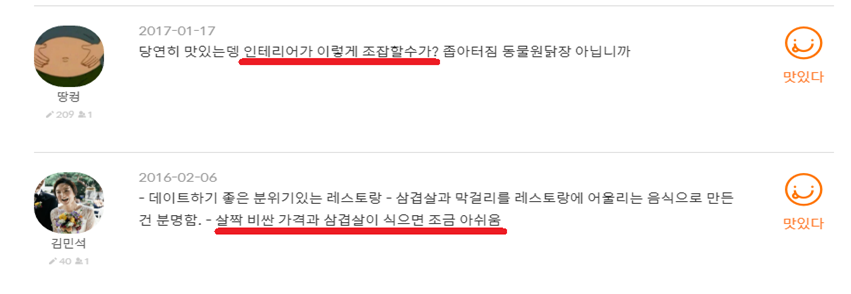
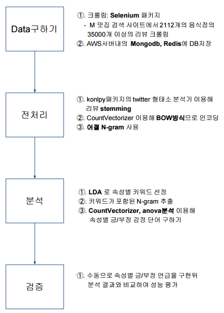
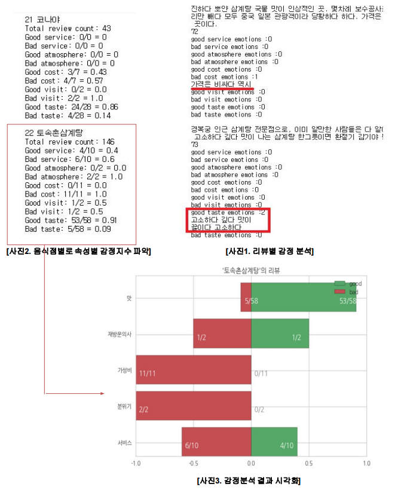

estimate review of restaurant
==========

#### 문제인식
긍정 리뷰내의 부정적인 평가 존재  
이러한 현상의 원인은 맛집을 평가하는 요소가 다양하기 때문이라고 판단  
맛집의 속성별로 리뷰를 파악하는 방법이 없음에 문제를 느낌

#### 해결 방안
자연어 처리 기술(NLP)로 리뷰를 분석하여
맛집을 평가하는 속성인,  
**맛. 분위기. 서비스. 가성비. 재방문의사**, 로
음식점을 재평가해본다

 
Workflow
-

 

Result
-

서울시내의 250개 음식점을 평가  
총 리뷰가 50개 이상인 음식점을 분석 대상으로 함 (일정길이 이하인 리뷰는 제외)

